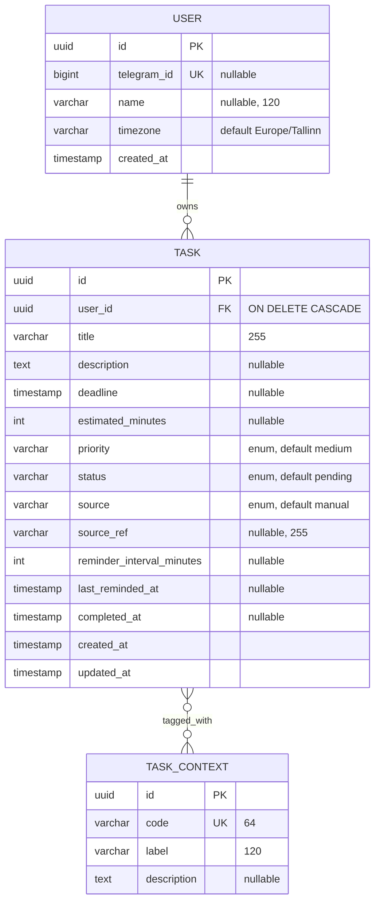

# Модель данных

Документ описывает доменные сущности AI Task Agent: их поля, связи, enum'ы, контексты задач и архитектурные решения. Соответствует Doctrine-маппингу в `app/src/Entity/` и миграции `Version20260415190533`.

## ER-диаграмма



Связь `Task ↔ TaskContext` — many-to-many через join-таблицу `task_context_link (task_id, context_id)`, оба FK с `ON DELETE CASCADE`.

## Сущности

### `App\Entity\User`

- **PK**: `id` UUID v7
- **`telegramId`** — `bigint`, `UNIQUE`, `nullable`. На этапе CLI пользователи создаются вручную через `app:user:create`; когда подключим Telegram, поле будет проставляться при первой команде `/start`.
- **`name`** — display name, `nullable`. Подтянется из Telegram.
- **`timezone`** — IANA-имя, default `Europe/Tallinn`. Нужно чтобы корректно интерпретировать дедлайны и расписания напоминаний.
- **`createdAt`** — выставляется в `#[PrePersist]` через `CreatedAtTrait`.
- **`tasks`** — `OneToMany → Task`, `cascade=['persist']`, `orphanRemoval=true`. Удаление пользователя каскадно удалит все его задачи (на стороне БД через `ON DELETE CASCADE`).

### `App\Entity\Task`

- **PK**: `id` UUID v7
- **`user`** — `ManyToOne → User`, `nullable=false`, `ON DELETE CASCADE`. Индекс `idx_tasks_user_status (user_id, status)` оптимизирован под основной запрос «активные задачи пользователя».
- **`title`** — `VARCHAR(255)`, обязательно.
- **`description`** — `TEXT`, опционально.
- **`deadline`** — `TIMESTAMP`, опционально. Индекс `idx_tasks_deadline` под выборки «что горит».
- **`estimatedMinutes`** — оценка трудозатрат. Поможет AI подбирать «короткие задачи» для контекста `quick`.
- **`priority`** — `TaskPriority`, default `MEDIUM`.
- **`status`** — `TaskStatus`, default `PENDING`.
- **`source`** — `TaskSource`, default `MANUAL`. Откуда задача попала в систему.
- **`sourceRef`** — внешний идентификатор (например, `message_id` из VK/Telegram), чтобы дедуплицировать повторные парсинги одного и того же сообщения.
- **`reminderIntervalMinutes`** — как часто напоминать пользователю. `null` = не напоминать.
- **`lastRemindedAt`** — когда последний раз напомнили. Используется планировщиком: «отправить, если `now - lastRemindedAt >= reminderIntervalMinutes`».
- **`completedAt`** — заполняется методом `markDone()` одновременно с переводом в `DONE`.
- **`createdAt`/`updatedAt`** — `TimestampableTrait`, лайфсайкл-коллбеки `#[PrePersist]`/`#[PreUpdate]`.
- **`contexts`** — `ManyToMany → TaskContext`, join-таблица `task_context_link`. Без inverse-стороны: контексты — это словарь, а не aggregate root.

### `App\Entity\TaskContext`

Словарь «ситуационных тегов». Заполняется один раз идемпотентным сидером `app:seed:contexts`.

- **`code`** — машинное имя (`UNIQUE`, `VARCHAR(64)`). Используется в коде, командах, AI-промптах.
- **`label`** — человекочитаемое имя для UI/Telegram-сообщений.
- **`description`** — опциональная подсказка.

## Enum'ы (`App\Enum\`)

Все enum'ы — PHP 8.1+ backed string, подключены через нативный атрибут Doctrine ORM 3:

```php
#[ORM\Column(type: 'string', length: 16, enumType: TaskPriority::class, options: ['default' => 'medium'])]
private TaskPriority $priority = TaskPriority::MEDIUM;
```

В Postgres хранятся как `VARCHAR(16)` с дефолтом. Отказ от нативных PG `ENUM` сознательный: их сложно мигрировать (`ALTER TYPE ... ADD VALUE` не откатывается одной транзакцией), и Doctrine не умеет с ними работать без кастомных типов.

| Enum            | Значения                                                                                          | Default     |
|-----------------|---------------------------------------------------------------------------------------------------|-------------|
| `TaskPriority`  | `low`, `medium`, `high`, `urgent`                                                                 | `medium`    |
| `TaskStatus`    | `pending`, `in_progress`, `done`, `cancelled`, `snoozed`                                          | `pending`   |
| `TaskSource`    | `manual`, `ai_parsed`, `vk`, `telegram`                                                           | `manual`    |

`TaskStatus::SNOOZED` нужен отдельным от `PENDING` чтобы отличать «ещё не начата» и «отложена пользователем» — это разные UX-сценарии и разные напоминания.

`TaskSource::AI_PARSED` означает, что задачу извлёк Claude из произвольного текста пользователя (например, «надо завтра позвонить врачу и купить кошке корм» → две задачи).

## Базовый набор контекстов

Сидер `app:seed:contexts` создаёт следующие коды (поле `code` → `label`):

| Code               | Label                       |
|--------------------|-----------------------------|
| `at_home`          | Дома                        |
| `outdoor`          | На улице / в дороге         |
| `at_dacha`         | На даче                     |
| `at_office`        | На работе / в офисе         |
| `needs_internet`   | Нужен интернет              |
| `needs_phone_call` | Требует звонка              |
| `quick`            | Короткая (до 15 минут)      |
| `focused`          | Требует концентрации        |
| `with_kids_ok`     | Можно делать с детьми       |

Идемпотентность достигается через `findOneBy(['code' => ...])` перед вставкой. При повторных запусках сидер ничего не добавляет, лог говорит «N contexts already exist, skipped».

## Почему UUID v7

Все PK — `Symfony\Component\Uid\Uuid::v7()`. В Postgres хранятся в нативном типе `UUID` через `Symfony\Bridge\Doctrine\Types\UuidType` (тип `uuid` зарегистрирован в `config/packages/doctrine.yaml` под именем `uuid`).

Почему именно v7, а не v4 или auto-increment:

1. **Сортируемость по времени.** Первые ~48 бит UUID v7 — это unix timestamp в миллисекундах. Это значит что:
   - PK естественно растёт во времени → меньше фрагментации B-tree индекса по сравнению с UUID v4
   - Можно сортировать по `id` вместо `created_at` для «последних созданных»
   - Лёгкая дебажность: по UUID видно когда создана запись

2. **Не привязан к одной БД.** В отличие от auto-increment, UUID можно генерировать на стороне приложения до `flush()`, что упрощает связывание сущностей в одной транзакции. Когда придёт второй сервис (worker / bot), id можно генерировать там же без коллизий.

3. **Не палит количество.** В отличие от serial, UUID не раскрывает «у нас всего N задач/пользователей» — это плюс для публичного API (Telegram URLs / web UI).

4. **Нативный тип в PG.** `UUID` занимает 16 байт, индексируется хорошо, парсится быстро. Дешевле чем `CHAR(36)` или `BYTEA`.

Минусы (которые мы готовы платить):
- Длинные строки в логах и URL → решается коротким префиксом (`substr(uuid, 0, 8)`) для UI.
- Чуть тяжелее `BIGSERIAL` по размеру PK → для нашего масштаба пренебрежимо.

## Решения, которые отложены

- **`TIMESTAMP WITHOUT TIME ZONE`** vs `TIMESTAMPTZ`. Сейчас все datetime-поля — `TIMESTAMP(0) WITHOUT TIME ZONE` (так Doctrine мапит `datetime_immutable` по умолчанию). Для приложения с пользовательскими таймзонами правильнее `TIMESTAMPTZ`. Отложено: переход требует кастомного Doctrine-типа или явного маппинга, делать это до того как есть реальные пользователи и багов с зонами — преждевременная оптимизация. Когда будет первый баг с дедлайном «не в той зоне», заведём `datetimetz_immutable`.
- **Soft delete для задач.** Сейчас удаления нет вообще, только статус `CANCELLED`. Если выяснится что нужен «удалить вообще не глядя» — добавим `deletedAt` + filter.
- **Историю изменений статусов** (audit log) — пока не нужна, при необходимости заведём отдельную таблицу `task_status_log`.
